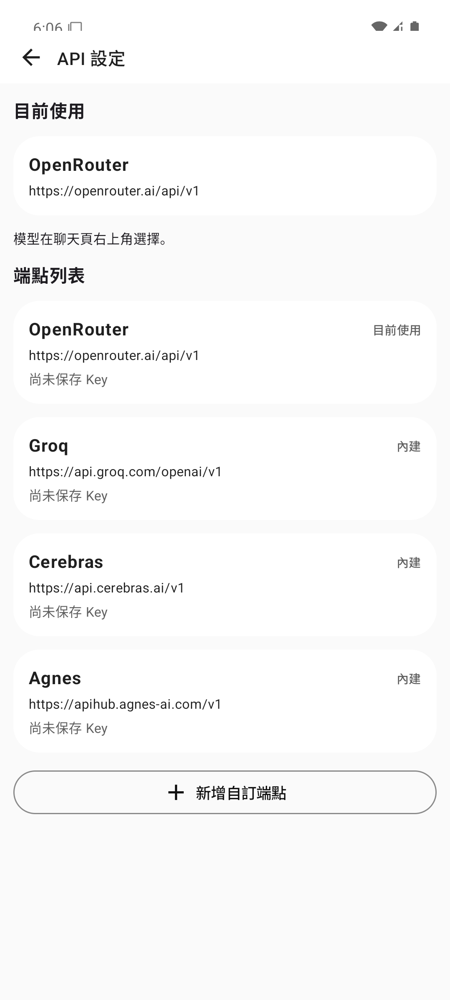
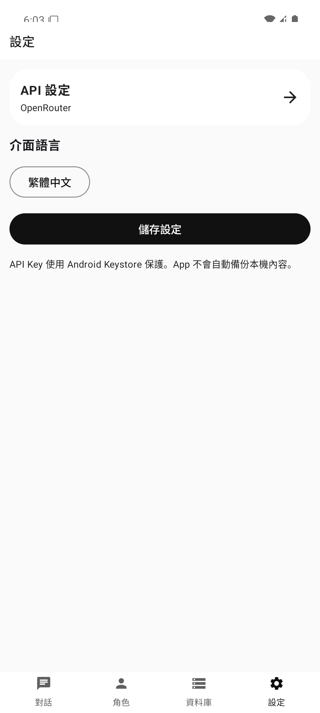

# 聽雪居

聽雪居是一款 Android 12+ 原生 AI 聊天 App，讓使用者自行連接 OpenAI 相容 API，並在本機管理對話、角色、Persona、世界設定與快捷端點。

- **平台：** Android 12 以上
- **最新版本：** v1.10
- **模型來源：** 雲端 API（目前不支援本地模型）
- **資料保存：** 聊天與設定保存在本機；API Key 由 Android Keystore 保護

[下載 v1.11 APK](https://github.com/BobJu0721/TingXueJu/releases/download/v1.11/TingXueJu-v1.11.apk) · [查看 Releases](https://github.com/BobJu0721/TingXueJu/releases) · [閱讀更新公告](更新公告.md)

## 畫面預覽

<table>
  <tr>
    <td align="center"><br>對話首頁</td>
    <td align="center"><br>API 端點管理</td>
    <td align="center"><br>設定頁</td>
  </tr>
</table>

上面狀態藍有被吃掉目前我並不清清楚是不是模擬器的問題，因為我自己的手機測試是沒這問題的，如有問題請回報

## 主要功能

- 支援 OpenRouter、Groq、Cerebras、Agnes 等內建供應商，以及自訂 OpenAI 相容 API 端點。
- 可保存多個自訂快捷端點，分別管理名稱、Base URL 與加密 API Key。
- 聊天頁可選擇模型，支援串流回覆與思考內容顯示。
- 在本機保存聊天紀錄、角色、Persona 與世界設定集。
- 角色與 Persona 支援分段表單，也可匯入 TXT、JSON、DOCX 文件交由 AI 整理成草稿。
- 長對話超出上下文限制時，可摘要較舊內容後自動重試。
- 支援對話命名、快速回到底部、自訂背景圖與對話框透明度。
- 跟隨系統深色模式，並支援 Android 預測返回與頁面滑動轉場。

## 下載與安裝

### 系統需求

- Android 12（API 31）或以上版本。
- 可連線至所選 API 供應商的網路環境。
- 使用者自己的 API Key；App 不提供共用 Key。

### 最新版本

- **版本：** v1.10
- **APK：** [TingXueJu-v1.10.apk](https://github.com/BobJu0721/TingXueJu/releases/download/v1.10/TingXueJu-v1.10.apk)
- **版本說明：** [GitHub Release v1.10](https://github.com/BobJu0721/TingXueJu/releases/tag/v1.10)
- **SHA-256：** `DC1018DDF45D6BFBAB8CDFAB945FCD88924ACDFBBE98EF05D5DFEEE58BC0E96A`

### 安裝步驟

1. 從上方連結下載 APK。
2. Android 提示時，允許目前的瀏覽器或檔案管理器安裝未知來源 App。
3. 開啟 APK 並完成安裝。
4. 若裝置上已有同簽章的舊版本，可直接覆蓋升級並保留本機資料。

請只從本專案的 GitHub Releases 下載 APK。

## 快速開始

1. 安裝並開啟聽雪居。
2. 前往「設定」→「API 設定」。
3. 選擇內建供應商，或新增自訂端點並填入名稱、Base URL、API Key。
4. 按下「設定為目前使用」，返回對話首頁。
5. 新增對話，在聊天頁選擇模型與角色後即可開始使用。

模型可用性、速率限制與費用由 API 供應商決定。

## 專案狀態與更新紀錄

| 項目 | 目前狀態 |
| --- | --- |
| 最新穩定版本 | v1.10 |
| 支援系統 | Android 12 以上 |
| 發布狀態 | 已提供正式簽章 APK |

v1.10 已完成單元測試、Release 建置與 Android 15 實機驗證。本版本主要改善啟動與操作流暢度、頁面返回動畫、Predictive Back、API 端點管理及聊天介面體驗。

- [完整更新公告](更新公告.md)
- [所有版本與 APK](https://github.com/BobJu0721/TingXueJu/releases)

## 問題回報

發現 Bug 或有功能建議，請前往 [GitHub Issues](https://github.com/BobJu0721/TingXueJu/issues) 回報。

回報時請附上 App 版本、Android 版本、手機型號、重現步驟與相關截圖。請勿公開 API Key 或私人對話內容。

## 開發建置

需要 JDK 17 與 Android SDK 35。Debug APK 輸出位置：

```text
app/build/outputs/apk/debug/app-debug.apk
```

本機建置與驗證：

```powershell
.\gradlew.bat testDebugUnitTest
.\gradlew.bat assembleDebug
```

## 注意事項

- API Key 使用 Android Keystore 保存，App 不會自動備份本機內容。
- 解除安裝 App 會刪除本機資料，升級前仍建議自行備份重要內容。
- 聊天內容會傳送至使用者選擇的 API 供應商，請先確認對方的隱私政策與費用規則。
- 自訂 HTTP 端點雖可使用，但 API Key 與聊天內容可能外洩，建議使用 HTTPS。
